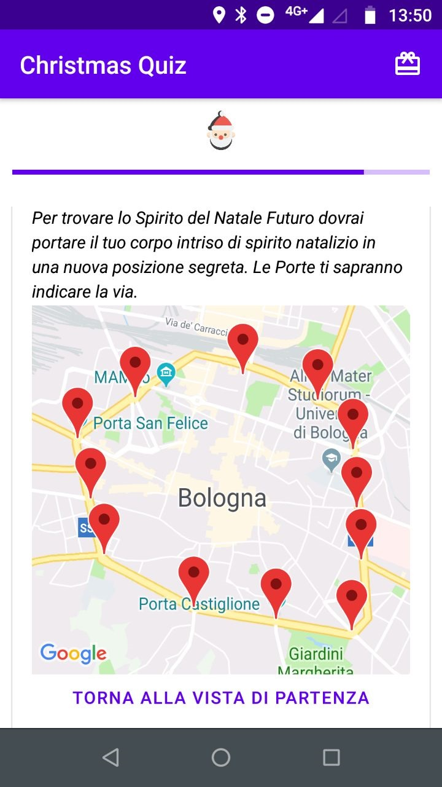

# christmas-quiz

A Christmas quiz built with react-native. Version 1.0.0

**Useful docs:**
* https://facebook.github.io/react-native/docs/getting-started.html
* https://expo.io/learn
* https://github.com/callstack/react-native-paper
* https://callstack.github.io/react-native-paper
* https://docs.expo.io/versions/latest/sdk/permissions
* https://docs.expo.io/versions/latest/sdk/filesystem
* https://docs.expo.io/versions/latest/sdk/speech
* https://docs.expo.io/versions/latest/sdk/map-view
* https://github.com/react-native-community/react-native-maps

**Troubleshooting**:
* https://github.com/react-community/create-react-native-app/issues/144
* https://medium.com/@Carmichaelize/dynamic-tag-names-in-react-and-jsx-17e366a684e9
* https://github.com/react-native-community/react-native-maps/issues/1611

**Screenshots**:

